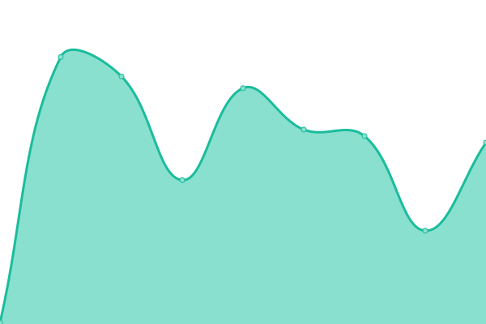

# [📈 Live Status](https://upptime.github.io/upptime): <!--live status--> **🟧 Partial outage**

This repository contains the open-source uptime monitor and status page for [Upptime](https://upptime.js.org), powered by [Upptime](https://github.com/upptime/upptime).

With [Upptime](https://upptime.js.org), you can get your own unlimited and free uptime monitor and status page, powered entirely by a GitHub repository. We use [Issues](https://github.com/upptime/upptime/issues) as incident reports, [Actions](https://github.com/upptime/upptime/actions) as uptime monitors, and [Pages](https://upptime.github.io/upptime) for the status page.

<!--start: status pages-->
<!-- This summary is generated by Upptime (https://github.com/upptime/upptime) -->
<!-- Do not edit this manually, your changes will be overwritten -->
<!-- prettier-ignore -->
| URL | Status | History | Response Time | Uptime |
| --- | ------ | ------- | ------------- | ------ |
|  [SeeU](https://seeu.me) | 🟩 Up | [see-u.yml](https://github.com/cmadera/uptime/commits/HEAD/history/see-u.yml) | 

 405ms
     
 | 

<a href="https://cmadera.github.io/cmadera/history/see-u">100.00%</a>
    

|  [Bigbank](https://bigbank.com.br) | 🟩 Up | [bigbank.yml](https://github.com/cmadera/uptime/commits/HEAD/history/bigbank.yml) | 

 339ms
     
 | 

<a href="https://cmadera.github.io/cmadera/history/bigbank">100.00%</a>
    

|  [Up SeeU](http://up.seeu.me) | 🟩 Up | [up-see-u.yml](https://github.com/cmadera/uptime/commits/HEAD/history/up-see-u.yml) | 

 202ms
     
 | 

<a href="https://cmadera.github.io/cmadera/history/up-see-u">100.00%</a>
    

|  [Test for HEAD](http://up.seeu.me) | 🟥 Down | [test-for-head.yml](https://github.com/cmadera/uptime/commits/HEAD/history/test-for-head.yml) | 

 18ms
     
 | 

<a href="https://cmadera.github.io/cmadera/history/test-for-head">100.00%</a>
    

<!--end: status pages-->

[**Visit our status website →**](https://upptime.github.io/upptime)

## 📄 License

- Powered by: [Upptime](https://github.com/upptime/upptime)
- Code: [MIT](./LICENSE) © [Upptime](https://upptime.js.org)
- Data in the `./history` directory: [Open Database License](https://opendatacommons.org/licenses/odbl/1-0/)
