# [📈 Live Status](https://upptime.github.io/upptime): <!--live status--> **🟩 All systems operational**

This repository contains the open-source uptime monitor and status page for [Upptime](https://upptime.js.org), powered by [Upptime](https://github.com/upptime/upptime).

With [Upptime](https://upptime.js.org), you can get your own unlimited and free uptime monitor and status page, powered entirely by a GitHub repository. We use [Issues](https://github.com/upptime/upptime/issues) as incident reports, [Actions](https://github.com/upptime/upptime/actions) as uptime monitors, and [Pages](https://upptime.github.io/upptime) for the status page.

<!--start: status pages-->
<!-- This summary is generated by Upptime (https://github.com/upptime/upptime) -->
<!-- Do not edit this manually, your changes will be overwritten -->
<!-- prettier-ignore -->
| URL | Status | History | Response Time | Uptime |
| --- | ------ | ------- | ------------- | ------ |
|  [SeeU](https://seeu.me) | 🟩 Up | [see-u.yml](https://github.com/cmadera/uptime/commits/HEAD/history/see-u.yml) | 

 182ms
     
 | 

<a href="https://git.seeu.me/history/see-u">100.00%</a>
    

|  [Bigbank](https://bigbank.com.br) | 🟩 Up | [bigbank.yml](https://github.com/cmadera/uptime/commits/HEAD/history/bigbank.yml) | 

 333ms
     
 | 

<a href="https://git.seeu.me/history/bigbank">99.20%</a>
    

|  [Up SeeU](http://up.seeu.me) | 🟩 Up | [up-see-u.yml](https://github.com/cmadera/uptime/commits/HEAD/history/up-see-u.yml) | 

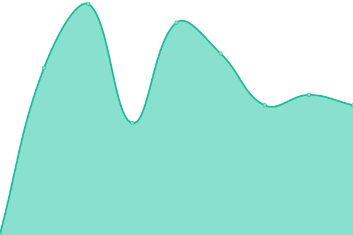 177ms
     
 | 

<a href="https://git.seeu.me/history/up-see-u">100.00%</a>
    

|  [corporativo.michelin.com.br](https://corporativo.michelin.com.br) | 🟩 Up | [corporativo-michelin-com-br.yml](https://github.com/cmadera/uptime/commits/HEAD/history/corporativo-michelin-com-br.yml) | 

 954ms
     
 | 

<a href="https://git.seeu.me/history/corporativo-michelin-com-br">100.00%</a>
    

|  [corporativo.michelin.com.ar](https://corporativo.michelin.com.ar) | 🟩 Up | [corporativo-michelin-com-ar.yml](https://github.com/cmadera/uptime/commits/HEAD/history/corporativo-michelin-com-ar.yml) | 

 667ms
     
 | 

<a href="https://git.seeu.me/history/corporativo-michelin-com-ar">100.00%</a>
    

|  [corporativo.michelinamericalatina.com](https://corporativo.michelinamericalatina.com) | 🟩 Up | [corporativo-michelinamericalatina-com.yml](https://github.com/cmadera/uptime/commits/HEAD/history/corporativo-michelinamericalatina-com.yml) | 

 980ms
     
 | 

<a href="https://git.seeu.me/history/corporativo-michelinamericalatina-com">100.00%</a>
    

|  [corporativo.michelin.com.ve](https://corporativo.michelin.com.ve) | 🟩 Up | [corporativo-michelin-com-ve.yml](https://github.com/cmadera/uptime/commits/HEAD/history/corporativo-michelin-com-ve.yml) | 

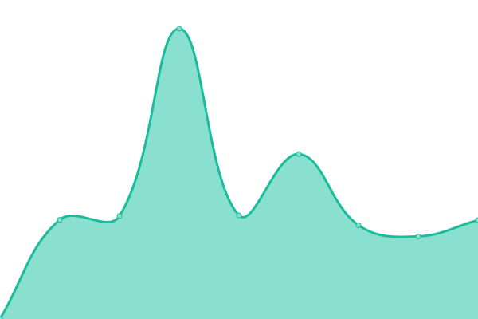 979ms
     
 | 

<a href="https://git.seeu.me/history/corporativo-michelin-com-ve">100.00%</a>
    

|  [corporativo.michelin.cl](https://corporativo.michelin.cl) | 🟩 Up | [corporativo-michelin-cl.yml](https://github.com/cmadera/uptime/commits/HEAD/history/corporativo-michelin-cl.yml) | 

 666ms
     
 | 

<a href="https://git.seeu.me/history/corporativo-michelin-cl">100.00%</a>
    

|  [rem.michelin.com.br](https://rem.michelin.com.br) | 🟩 Up | [rem-michelin-com-br.yml](https://github.com/cmadera/uptime/commits/HEAD/history/rem-michelin-com-br.yml) | 

 1369ms
     
 | 

<a href="https://git.seeu.me/history/rem-michelin-com-br">100.00%</a>
    

|  [corporativo.michelin.com.ec](https://corporativo.michelin.com.ec) | 🟩 Up | [corporativo-michelin-com-ec.yml](https://github.com/cmadera/uptime/commits/HEAD/history/corporativo-michelin-com-ec.yml) | 

 547ms
     
 | 

<a href="https://git.seeu.me/history/corporativo-michelin-com-ec">100.00%</a>
    

|  [neumaticostigar.com.ar](https://neumaticostigar.com.ar) | 🟩 Up | [neumaticostigar-com-ar.yml](https://github.com/cmadera/uptime/commits/HEAD/history/neumaticostigar-com-ar.yml) | 

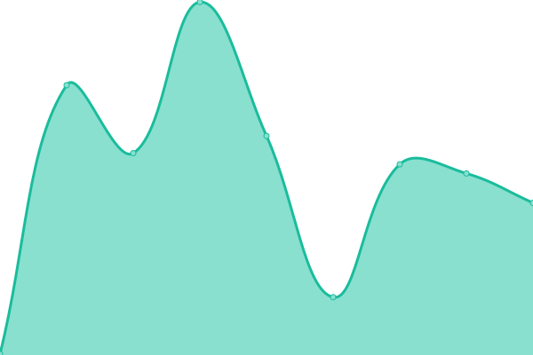 283ms
     
 | 

<a href="https://git.seeu.me/history/neumaticostigar-com-ar">100.00%</a>
    

|  [www.bfgoodrichcolombia.com](https://www.bfgoodrichcolombia.com) | 🟩 Up | [www-bfgoodrichcolombia-com.yml](https://github.com/cmadera/uptime/commits/HEAD/history/www-bfgoodrichcolombia-com.yml) | 

 145ms
     
 | 

<a href="https://git.seeu.me/history/www-bfgoodrichcolombia-com">100.00%</a>
    

|  [llantastigar.com.co](https://llantastigar.com.co) | 🟩 Up | [llantastigar-com-co.yml](https://github.com/cmadera/uptime/commits/HEAD/history/llantastigar-com-co.yml) | 

 148ms
     
 | 

<a href="https://git.seeu.me/history/llantastigar-com-co">100.00%</a>
    

|  [llantastigar.com.ec](https://llantastigar.com.ec) | 🟩 Up | [llantastigar-com-ec.yml](https://github.com/cmadera/uptime/commits/HEAD/history/llantastigar-com-ec.yml) | 

 237ms
     
 | 

<a href="https://git.seeu.me/history/llantastigar-com-ec">100.00%</a>
    

|  [llantastigar.com.pe](https://llantastigar.com.pe) | 🟩 Up | [llantastigar-com-pe.yml](https://github.com/cmadera/uptime/commits/HEAD/history/llantastigar-com-pe.yml) | 

 227ms
     
 | 

<a href="https://git.seeu.me/history/llantastigar-com-pe">100.00%</a>
    

|  [pneustigar.com.br](https://pneustigar.com.br) | 🟩 Up | [pneustigar-com-br.yml](https://github.com/cmadera/uptime/commits/HEAD/history/pneustigar-com-br.yml) | 

 216ms
     
 | 

<a href="https://git.seeu.me/history/pneustigar-com-br">100.00%</a>
    

|  [corporativo.michelin.com.pe](https://corporativo.michelin.com.pe) | 🟩 Up | [corporativo-michelin-com-pe.yml](https://github.com/cmadera/uptime/commits/HEAD/history/corporativo-michelin-com-pe.yml) | 

 744ms
     
 | 

<a href="https://git.seeu.me/history/corporativo-michelin-com-pe">100.00%</a>
    

|  [corporativo.michelin.com.co](https://corporativo.michelin.com.co) | 🟩 Up | [corporativo-michelin-com-co.yml](https://github.com/cmadera/uptime/commits/HEAD/history/corporativo-michelin-com-co.yml) | 

 874ms
     
 | 

<a href="https://git.seeu.me/history/corporativo-michelin-com-co">100.00%</a>
    

|  [www.michelin.com.ar](https://www.michelin.com.ar) | 🟩 Up | [www-michelin-com-ar.yml](https://github.com/cmadera/uptime/commits/HEAD/history/www-michelin-com-ar.yml) | 

 235ms
     
 | 

<a href="https://git.seeu.me/history/www-michelin-com-ar">100.00%</a>
    

|  [www.michelin.com.co](https://www.michelin.com.co) | 🟩 Up | [www-michelin-com-co.yml](https://github.com/cmadera/uptime/commits/HEAD/history/www-michelin-com-co.yml) | 

 160ms
     
 | 

<a href="https://git.seeu.me/history/www-michelin-com-co">100.00%</a>
    

|  [www.bfgoodrich.cl](https://www.bfgoodrich.cl) | 🟩 Up | [www-bfgoodrich-cl.yml](https://github.com/cmadera/uptime/commits/HEAD/history/www-bfgoodrich-cl.yml) | 

 199ms
     
 | 

<a href="https://git.seeu.me/history/www-bfgoodrich-cl">100.00%</a>
    

|  [www.michelin.cl](https://www.michelin.cl) | 🟩 Up | [www-michelin-cl.yml](https://github.com/cmadera/uptime/commits/HEAD/history/www-michelin-cl.yml) | 

 196ms
     
 | 

<a href="https://git.seeu.me/history/www-michelin-cl">100.00%</a>
    

|  [www.michelin.com.pe](https://www.michelin.com.pe) | 🟩 Up | [www-michelin-com-pe.yml](https://github.com/cmadera/uptime/commits/HEAD/history/www-michelin-com-pe.yml) | 

 234ms
     
 | 

<a href="https://git.seeu.me/history/www-michelin-com-pe">100.00%</a>
    

|  [www.michelin.com.br](https://www.michelin.com.br) | 🟩 Up | [www-michelin-com-br.yml](https://github.com/cmadera/uptime/commits/HEAD/history/www-michelin-com-br.yml) | 

 172ms
     
 | 

<a href="https://git.seeu.me/history/www-michelin-com-br">100.00%</a>
    

|  [www.pneusbfgoodrich.com.br](https://www.pneusbfgoodrich.com.br) | 🟩 Up | [www-pneusbfgoodrich-com-br.yml](https://github.com/cmadera/uptime/commits/HEAD/history/www-pneusbfgoodrich-com-br.yml) | 

 187ms
     
 | 

<a href="https://git.seeu.me/history/www-pneusbfgoodrich-com-br">100.00%</a>
    

|  [www.bfgoodrichargentina.com.ar](https://www.bfgoodrichargentina.com.ar) | 🟩 Up | [www-bfgoodrichargentina-com-ar.yml](https://github.com/cmadera/uptime/commits/HEAD/history/www-bfgoodrichargentina-com-ar.yml) | 

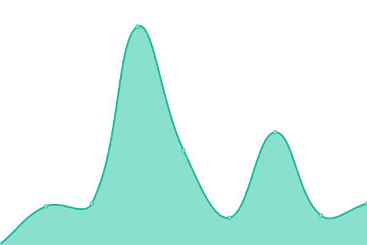 216ms
     
 | 

<a href="https://git.seeu.me/history/www-bfgoodrichargentina-com-ar">100.00%</a>
    

|  [www.michelinamericalatina.com](https://www.michelinamericalatina.com) | 🟩 Up | [www-michelinamericalatina-com.yml](https://github.com/cmadera/uptime/commits/HEAD/history/www-michelinamericalatina-com.yml) | 

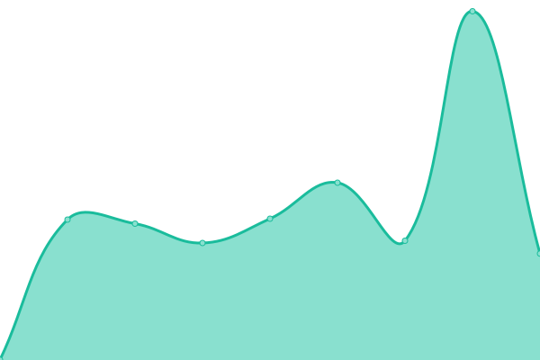 582ms
     
 | 

<a href="https://git.seeu.me/history/www-michelinamericalatina-com">99.74%</a>
    

|  [www.pneustigar.com.br](https://www.pneustigar.com.br) | 🟩 Up | [www-pneustigar-com-br.yml](https://github.com/cmadera/uptime/commits/HEAD/history/www-pneustigar-com-br.yml) | 

 314ms
     
 | 

<a href="https://git.seeu.me/history/www-pneustigar-com-br">100.00%</a>
    

|  [www.levorin.com.br](https://www.levorin.com.br) | 🟩 Up | [www-levorin-com-br.yml](https://github.com/cmadera/uptime/commits/HEAD/history/www-levorin-com-br.yml) | 

 573ms
     
 | 

<a href="https://git.seeu.me/history/www-levorin-com-br">100.00%</a>
    

|  [www.llantastigar.com.co](https://www.llantastigar.com.co) | 🟩 Up | [www-llantastigar-com-co.yml](https://github.com/cmadera/uptime/commits/HEAD/history/www-llantastigar-com-co.yml) | 

 217ms
     
 | 

<a href="https://git.seeu.me/history/www-llantastigar-com-co">100.00%</a>
    

|  [www.llantastigar.com.ec](https://www.llantastigar.com.ec) | 🟩 Up | [www-llantastigar-com-ec.yml](https://github.com/cmadera/uptime/commits/HEAD/history/www-llantastigar-com-ec.yml) | 

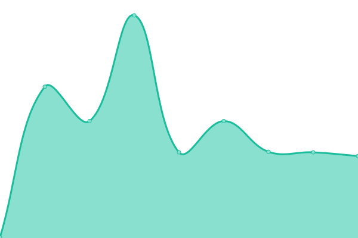 298ms
     
 | 

<a href="https://git.seeu.me/history/www-llantastigar-com-ec">100.00%</a>
    

|  [www.llantastigar.com.pe](https://www.llantastigar.com.pe) | 🟩 Up | [www-llantastigar-com-pe.yml](https://github.com/cmadera/uptime/commits/HEAD/history/www-llantastigar-com-pe.yml) | 

 335ms
     
 | 

<a href="https://git.seeu.me/history/www-llantastigar-com-pe">100.00%</a>
    

|  [www.neumaticostigar.com.ar](https://www.neumaticostigar.com.ar) | 🟩 Up | [www-neumaticostigar-com-ar.yml](https://github.com/cmadera/uptime/commits/HEAD/history/www-neumaticostigar-com-ar.yml) | 

 308ms
     
 | 

<a href="https://git.seeu.me/history/www-neumaticostigar-com-ar">100.00%</a>
    

|  [uniroyal.com.br](https://uniroyal.com.br) | 🟩 Up | [uniroyal-com-br.yml](https://github.com/cmadera/uptime/commits/HEAD/history/uniroyal-com-br.yml) | 

 188ms
     
 | 

<a href="https://git.seeu.me/history/uniroyal-com-br">100.00%</a>
    

|  [camiones-omnibus.michelin.com.ar](https://camiones-omnibus.michelin.com.ar) | 🟩 Up | [camiones-omnibus-michelin-com-ar.yml](https://github.com/cmadera/uptime/commits/HEAD/history/camiones-omnibus-michelin-com-ar.yml) | 

 213ms
     
 | 

<a href="https://git.seeu.me/history/camiones-omnibus-michelin-com-ar">100.00%</a>
    

|  [caminhoes-onibus.michelin.com.br](https://caminhoes-onibus.michelin.com.br) | 🟩 Up | [caminhoes-onibus-michelin-com-br.yml](https://github.com/cmadera/uptime/commits/HEAD/history/caminhoes-onibus-michelin-com-br.yml) | 

 197ms
     
 | 

<a href="https://git.seeu.me/history/caminhoes-onibus-michelin-com-br">100.00%</a>
    

|  [camiones-omnibus.michelin.cl](https://camiones-omnibus.michelin.cl) | 🟩 Up | [camiones-omnibus-michelin-cl.yml](https://github.com/cmadera/uptime/commits/HEAD/history/camiones-omnibus-michelin-cl.yml) | 

 593ms
     
 | 

<a href="https://git.seeu.me/history/camiones-omnibus-michelin-cl">100.00%</a>
    

|  [camiones-omnibus.michelin.com.ec](https://camiones-omnibus.michelin.com.ec) | 🟩 Up | [camiones-omnibus-michelin-com-ec.yml](https://github.com/cmadera/uptime/commits/HEAD/history/camiones-omnibus-michelin-com-ec.yml) | 

 636ms
     
 | 

<a href="https://git.seeu.me/history/camiones-omnibus-michelin-com-ec">100.00%</a>
    

|  [camiones-omnibus.michelin.com.pe](https://camiones-omnibus.michelin.com.pe) | 🟩 Up | [camiones-omnibus-michelin-com-pe.yml](https://github.com/cmadera/uptime/commits/HEAD/history/camiones-omnibus-michelin-com-pe.yml) | 

 579ms
     
 | 

<a href="https://git.seeu.me/history/camiones-omnibus-michelin-com-pe">100.00%</a>
    

|  [camiones-omnibus.michelin.com.co](https://camiones-omnibus.michelin.com.co) | 🟩 Up | [camiones-omnibus-michelin-com-co.yml](https://github.com/cmadera/uptime/commits/HEAD/history/camiones-omnibus-michelin-com-co.yml) | 

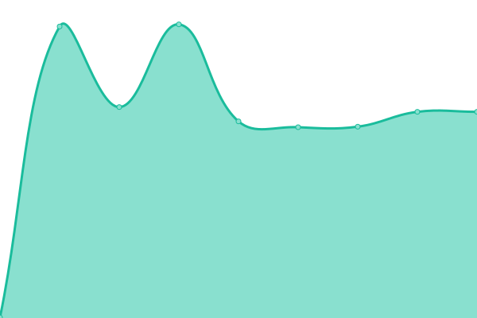 489ms
     
 | 

<a href="https://git.seeu.me/history/camiones-omnibus-michelin-com-co">100.00%</a>
    

|  [camiones-omnibus.michelin.com.ve](https://camiones-omnibus.michelin.com.ve) | 🟩 Up | [camiones-omnibus-michelin-com-ve.yml](https://github.com/cmadera/uptime/commits/HEAD/history/camiones-omnibus-michelin-com-ve.yml) | 

 747ms
     
 | 

<a href="https://git.seeu.me/history/camiones-omnibus-michelin-com-ve">100.00%</a>
    

|  [red.michelin.com.ar](https://red.michelin.com.ar) | 🟩 Up | [red-michelin-com-ar.yml](https://github.com/cmadera/uptime/commits/HEAD/history/red-michelin-com-ar.yml) | 

 352ms
     
 | 

<a href="https://git.seeu.me/history/red-michelin-com-ar">100.00%</a>
    

|  [stage.ar.camso.co](https://stage.ar.camso.co) | 🟩 Up | [stage-ar-camso-co.yml](https://github.com/cmadera/uptime/commits/HEAD/history/stage-ar-camso-co.yml) | 

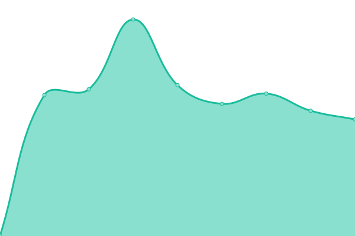 839ms
     
 | 

<a href="https://git.seeu.me/history/stage-ar-camso-co">100.00%</a>
    

|  [stage.br.camso.co](https://stage.br.camso.co) | 🟩 Up | [stage-br-camso-co.yml](https://github.com/cmadera/uptime/commits/HEAD/history/stage-br-camso-co.yml) | 

 883ms
     
 | 

<a href="https://git.seeu.me/history/stage-br-camso-co">100.00%</a>
    

|  [red.michelin.cl](https://red.michelin.cl) | 🟩 Up | [red-michelin-cl.yml](https://github.com/cmadera/uptime/commits/HEAD/history/red-michelin-cl.yml) | 

 540ms
     
 | 

<a href="https://git.seeu.me/history/red-michelin-cl">100.00%</a>
    

|  [redemichelinboapratica.net](https://redemichelinboapratica.net) | 🟩 Up | [redemichelinboapratica-net.yml](https://github.com/cmadera/uptime/commits/HEAD/history/redemichelinboapratica-net.yml) | 

 211ms
     
 | 

<a href="https://git.seeu.me/history/redemichelinboapratica-net">100.00%</a>
    

|  [www.michelin-ads.com](https://www.michelin-ads.com) | 🟩 Up | [www-michelin-ads-com.yml](https://github.com/cmadera/uptime/commits/HEAD/history/www-michelin-ads-com.yml) | 

 619ms
     
 | 

<a href="https://git.seeu.me/history/www-michelin-ads-com">100.00%</a>
    

|  [www.redmichelin.com](https://www.redmichelin.com) | 🟩 Up | [www-redmichelin-com.yml](https://github.com/cmadera/uptime/commits/HEAD/history/www-redmichelin-com.yml) | 

 749ms
     
 | 

<a href="https://git.seeu.me/history/www-redmichelin-com">100.00%</a>
    

|  [www.redemichelin.com.br](https://www.redemichelin.com.br) | 🟩 Up | [www-redemichelin-com-br.yml](https://github.com/cmadera/uptime/commits/HEAD/history/www-redemichelin-com-br.yml) | 

 792ms
     
 | 

<a href="https://git.seeu.me/history/www-redemichelin-com-br">100.00%</a>
    

|  [compras.michelin-ads.com](https://compras.michelin-ads.com) | 🟩 Up | [compras-michelin-ads-com.yml](https://github.com/cmadera/uptime/commits/HEAD/history/compras-michelin-ads-com.yml) | 

 267ms
     
 | 

<a href="https://git.seeu.me/history/compras-michelin-ads-com">100.00%</a>
    

|  [bibnetads-qa.michelin.com/bibnetBR](https://bibnetads-qa.michelin.com/bibnetBR) | 🟩 Up | [bibnetads-qa-michelin-com-bibnet-br.yml](https://github.com/cmadera/uptime/commits/HEAD/history/bibnetads-qa-michelin-com-bibnet-br.yml) | 

 702ms
     
 | 

<a href="https://git.seeu.me/history/bibnetads-qa-michelin-com-bibnet-br">100.00%</a>
    

|  [cardealer.michelin.com.br](https://cardealer.michelin.com.br) | 🟩 Up | [cardealer-michelin-com-br.yml](https://github.com/cmadera/uptime/commits/HEAD/history/cardealer-michelin-com-br.yml) | 

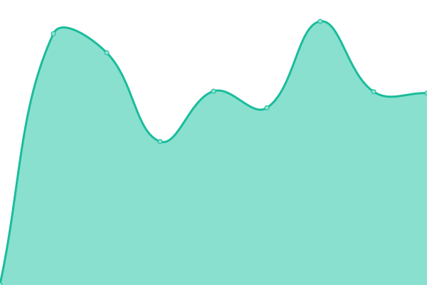 422ms
     
 | 

<a href="https://git.seeu.me/history/cardealer-michelin-com-br">100.00%</a>
    

|  [fleetmanager.michelin.com.br](https://fleetmanager.michelin.com.br) | 🟩 Up | [fleetmanager-michelin-com-br.yml](https://github.com/cmadera/uptime/commits/HEAD/history/fleetmanager-michelin-com-br.yml) | 

 409ms
     
 | 

<a href="https://git.seeu.me/history/fleetmanager-michelin-com-br">100.00%</a>
    

|  [api.fleetmanager.michelin.com.br](https://api.fleetmanager.michelin.com.br) | 🟩 Up | [api-fleetmanager-michelin-com-br.yml](https://github.com/cmadera/uptime/commits/HEAD/history/api-fleetmanager-michelin-com-br.yml) | 

 404ms
     
 | 

<a href="https://git.seeu.me/history/api-fleetmanager-michelin-com-br">100.00%</a>
    

|  [dmichelin.brprop.com.br](https://dmichelin.brprop.com.br) | 🟩 Up | [dmichelin-brprop-com-br.yml](https://github.com/cmadera/uptime/commits/HEAD/history/dmichelin-brprop-com-br.yml) | 

 3577ms
     
 | 

<a href="https://git.seeu.me/history/dmichelin-brprop-com-br">100.00%</a>
    

|  [www.guiadopneu.com.br](https://www.guiadopneu.com.br) | 🟩 Up | [www-guiadopneu-com-br.yml](https://github.com/cmadera/uptime/commits/HEAD/history/www-guiadopneu-com-br.yml) | 

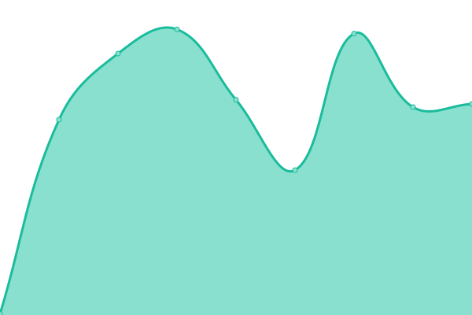 231ms
     
 | 

<a href="https://git.seeu.me/history/www-guiadopneu-com-br">100.00%</a>
    

|  [ofertasmichelin.com.br](https://ofertasmichelin.com.br) | 🟩 Up | [ofertasmichelin-com-br.yml](https://github.com/cmadera/uptime/commits/HEAD/history/ofertasmichelin-com-br.yml) | 

 804ms
     
 | 

<a href="https://git.seeu.me/history/ofertasmichelin-com-br">100.00%</a>
    

|  [vagas.michelin.com.br](https://vagas.michelin.com.br) | 🟩 Up | [vagas-michelin-com-br.yml](https://github.com/cmadera/uptime/commits/HEAD/history/vagas-michelin-com-br.yml) | 

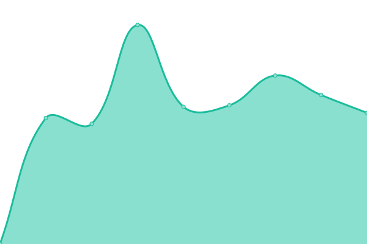 1713ms
     
 | 

<a href="https://git.seeu.me/history/vagas-michelin-com-br">100.00%</a>
    

|  [bibnetads.michelin.com](https://bibnetads.michelin.com) | 🟩 Up | [bibnetads-michelin-com.yml](https://github.com/cmadera/uptime/commits/HEAD/history/bibnetads-michelin-com.yml) | 

 919ms
     
 | 

<a href="https://git.seeu.me/history/bibnetads-michelin-com">100.00%</a>
    

|  [webads.michelin.com](https://webads.michelin.com) | 🟩 Up | [webads-michelin-com.yml](https://github.com/cmadera/uptime/commits/HEAD/history/webads-michelin-com.yml) | 

 854ms
     
 | 

<a href="https://git.seeu.me/history/webads-michelin-com">100.00%</a>
    

|  [rutasegura.michelin.com.co](https://rutasegura.michelin.com.co) | 🟩 Up | [rutasegura-michelin-com-co.yml](https://github.com/cmadera/uptime/commits/HEAD/history/rutasegura-michelin-com-co.yml) | 

 1551ms
     
 | 

<a href="https://git.seeu.me/history/rutasegura-michelin-com-co">100.00%</a>
    

|  [extranetlevorin.com](https://extranetlevorin.com) | 🟩 Up | [extranetlevorin-com.yml](https://github.com/cmadera/uptime/commits/HEAD/history/extranetlevorin-com.yml) | 

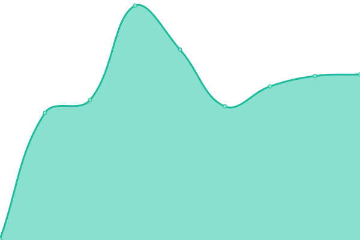 229ms
     
 | 

<a href="https://git.seeu.me/history/extranetlevorin-com">100.00%</a>
    

|  [www.ofertasmichelin.com.br](https://www.ofertasmichelin.com.br) | 🟩 Up | [www-ofertasmichelin-com-br.yml](https://github.com/cmadera/uptime/commits/HEAD/history/www-ofertasmichelin-com-br.yml) | 

 1457ms
     
 | 

<a href="https://git.seeu.me/history/www-ofertasmichelin-com-br">100.00%</a>
    

|  [www.redemichelinboapratica.net](https://www.redemichelinboapratica.net) | 🟩 Up | [www-redemichelinboapratica-net.yml](https://github.com/cmadera/uptime/commits/HEAD/history/www-redemichelinboapratica-net.yml) | 

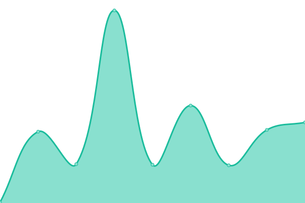 195ms
     
 | 

<a href="https://git.seeu.me/history/www-redemichelinboapratica-net">100.00%</a>
    

|  [tbsgc.michelin-ads.com](https://tbsgc.michelin-ads.com) | 🟩 Up | [tbsgc-michelin-ads-com.yml](https://github.com/cmadera/uptime/commits/HEAD/history/tbsgc-michelin-ads-com.yml) | 

 167ms
     
 | 

<a href="https://git.seeu.me/history/tbsgc-michelin-ads-com">100.00%</a>
    

<!--end: status pages-->

[**Visit our status website →**](https://upptime.github.io/upptime)

## 📄 License

- Powered by: [Upptime](https://github.com/upptime/upptime)
- Code: [MIT](./LICENSE) © [Upptime](https://upptime.js.org)
- Data in the `./history` directory: [Open Database License](https://opendatacommons.org/licenses/odbl/1-0/)
