# [📈 Live Status](https://upptime.github.io/upptime): <!--live status--> **🟧 Partial outage**

This repository contains the open-source uptime monitor and status page for [Upptime](https://upptime.js.org), powered by [Upptime](https://github.com/upptime/upptime).

With [Upptime](https://upptime.js.org), you can get your own unlimited and free uptime monitor and status page, powered entirely by a GitHub repository. We use [Issues](https://github.com/upptime/upptime/issues) as incident reports, [Actions](https://github.com/upptime/upptime/actions) as uptime monitors, and [Pages](https://upptime.github.io/upptime) for the status page.

<!--start: status pages-->
<!-- This summary is generated by Upptime (https://github.com/upptime/upptime) -->
<!-- Do not edit this manually, your changes will be overwritten -->
<!-- prettier-ignore -->
| URL | Status | History | Response Time | Uptime |
| --- | ------ | ------- | ------------- | ------ |
|  [SeeU](https://seeu.me) | 🟩 Up | [see-u.yml](https://github.com/cmadera/uptime/commits/HEAD/history/see-u.yml) | 

 146ms
     
 | 

<a href="https://git.seeu.me/history/see-u">100.00%</a>
    

|  [Bigbank](https://bigbank.com.br) | 🟩 Up | [bigbank.yml](https://github.com/cmadera/uptime/commits/HEAD/history/bigbank.yml) | 

 251ms
     
 | 

<a href="https://git.seeu.me/history/bigbank">100.00%</a>
    

|  [Up SeeU](http://up.seeu.me) | 🟩 Up | [up-see-u.yml](https://github.com/cmadera/uptime/commits/HEAD/history/up-see-u.yml) | 

 180ms
     
 | 

<a href="https://git.seeu.me/history/up-see-u">100.00%</a>
    

|  [corporativo.michelin.com.br](https://corporativo.michelin.com.br) | 🟩 Up | [corporativo-michelin-com-br.yml](https://github.com/cmadera/uptime/commits/HEAD/history/corporativo-michelin-com-br.yml) | 

 1375ms
     
 | 

<a href="https://git.seeu.me/history/corporativo-michelin-com-br">100.00%</a>
    

|  [corporativo.michelin.com.ar](https://corporativo.michelin.com.ar) | 🟩 Up | [corporativo-michelin-com-ar.yml](https://github.com/cmadera/uptime/commits/HEAD/history/corporativo-michelin-com-ar.yml) | 

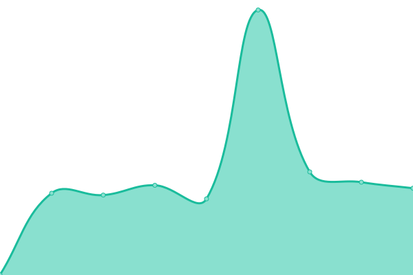 673ms
     
 | 

<a href="https://git.seeu.me/history/corporativo-michelin-com-ar">100.00%</a>
    

|  [corporativo.michelinamericalatina.com](https://corporativo.michelinamericalatina.com) | 🟩 Up | [corporativo-michelinamericalatina-com.yml](https://github.com/cmadera/uptime/commits/HEAD/history/corporativo-michelinamericalatina-com.yml) | 

 813ms
     
 | 

<a href="https://git.seeu.me/history/corporativo-michelinamericalatina-com">100.00%</a>
    

|  [corporativo.michelin.com.ve](https://corporativo.michelin.com.ve) | 🟩 Up | [corporativo-michelin-com-ve.yml](https://github.com/cmadera/uptime/commits/HEAD/history/corporativo-michelin-com-ve.yml) | 

 757ms
     
 | 

<a href="https://git.seeu.me/history/corporativo-michelin-com-ve">100.00%</a>
    

|  [corporativo.michelin.cl](https://corporativo.michelin.cl) | 🟩 Up | [corporativo-michelin-cl.yml](https://github.com/cmadera/uptime/commits/HEAD/history/corporativo-michelin-cl.yml) | 

 735ms
     
 | 

<a href="https://git.seeu.me/history/corporativo-michelin-cl">100.00%</a>
    

|  [rem.michelin.com.br](https://rem.michelin.com.br) | 🟩 Up | [rem-michelin-com-br.yml](https://github.com/cmadera/uptime/commits/HEAD/history/rem-michelin-com-br.yml) | 

 1549ms
     
 | 

<a href="https://git.seeu.me/history/rem-michelin-com-br">100.00%</a>
    

|  [corporativo.michelin.com.ec](https://corporativo.michelin.com.ec) | 🟩 Up | [corporativo-michelin-com-ec.yml](https://github.com/cmadera/uptime/commits/HEAD/history/corporativo-michelin-com-ec.yml) | 

 743ms
     
 | 

<a href="https://git.seeu.me/history/corporativo-michelin-com-ec">100.00%</a>
    

|  [neumaticostigar.com.ar](https://neumaticostigar.com.ar) | 🟩 Up | [neumaticostigar-com-ar.yml](https://github.com/cmadera/uptime/commits/HEAD/history/neumaticostigar-com-ar.yml) | 

 347ms
     
 | 

<a href="https://git.seeu.me/history/neumaticostigar-com-ar">100.00%</a>
    

|  [www.bfgoodrichcolombia.com](https://www.bfgoodrichcolombia.com) | 🟩 Up | [www-bfgoodrichcolombia-com.yml](https://github.com/cmadera/uptime/commits/HEAD/history/www-bfgoodrichcolombia-com.yml) | 

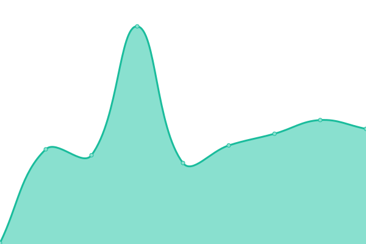 273ms
     
 | 

<a href="https://git.seeu.me/history/www-bfgoodrichcolombia-com">100.00%</a>
    

|  [llantastigar.com.co](https://llantastigar.com.co) | 🟩 Up | [llantastigar-com-co.yml](https://github.com/cmadera/uptime/commits/HEAD/history/llantastigar-com-co.yml) | 

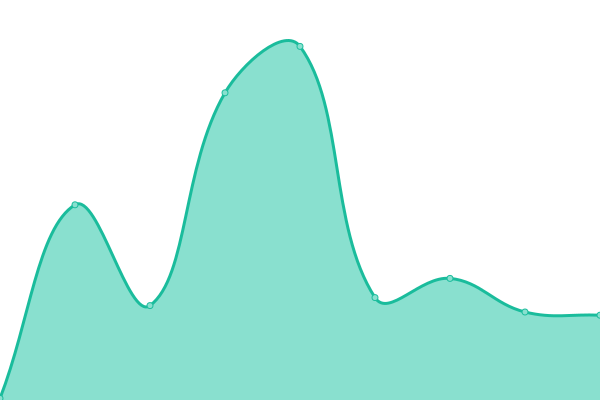 232ms
     
 | 

<a href="https://git.seeu.me/history/llantastigar-com-co">100.00%</a>
    

|  [llantastigar.com.ec](https://llantastigar.com.ec) | 🟩 Up | [llantastigar-com-ec.yml](https://github.com/cmadera/uptime/commits/HEAD/history/llantastigar-com-ec.yml) | 

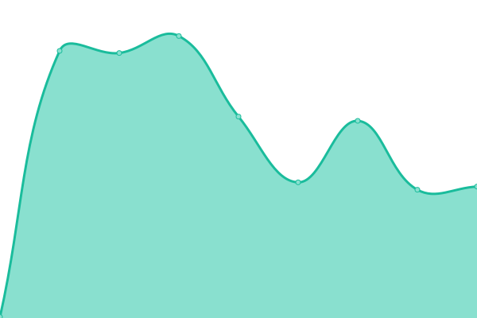 372ms
     
 | 

<a href="https://git.seeu.me/history/llantastigar-com-ec">100.00%</a>
    

|  [llantastigar.com.pe](https://llantastigar.com.pe) | 🟩 Up | [llantastigar-com-pe.yml](https://github.com/cmadera/uptime/commits/HEAD/history/llantastigar-com-pe.yml) | 

 317ms
     
 | 

<a href="https://git.seeu.me/history/llantastigar-com-pe">100.00%</a>
    

|  [pneustigar.com.br](https://pneustigar.com.br) | 🟩 Up | [pneustigar-com-br.yml](https://github.com/cmadera/uptime/commits/HEAD/history/pneustigar-com-br.yml) | 

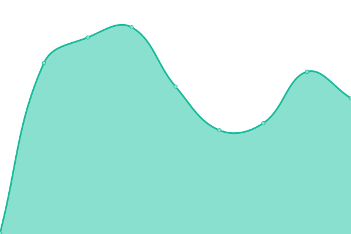 299ms
     
 | 

<a href="https://git.seeu.me/history/pneustigar-com-br">100.00%</a>
    

|  [corporativo.michelin.com.pe](https://corporativo.michelin.com.pe) | 🟩 Up | [corporativo-michelin-com-pe.yml](https://github.com/cmadera/uptime/commits/HEAD/history/corporativo-michelin-com-pe.yml) | 

 840ms
     
 | 

<a href="https://git.seeu.me/history/corporativo-michelin-com-pe">100.00%</a>
    

|  [corporativo.michelin.com.co](https://corporativo.michelin.com.co) | 🟩 Up | [corporativo-michelin-com-co.yml](https://github.com/cmadera/uptime/commits/HEAD/history/corporativo-michelin-com-co.yml) | 

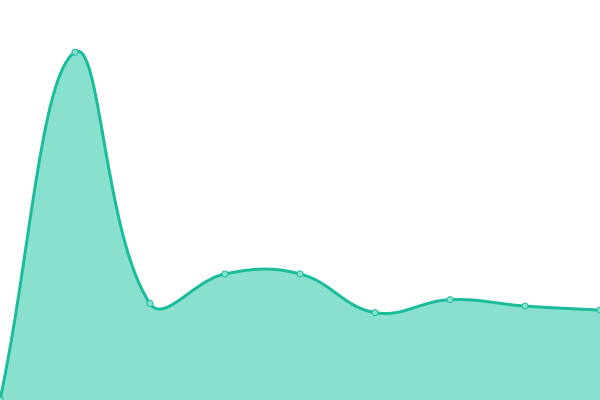 662ms
     
 | 

<a href="https://git.seeu.me/history/corporativo-michelin-com-co">100.00%</a>
    

|  [www.michelin.com.ar](https://www.michelin.com.ar) | 🟩 Up | [www-michelin-com-ar.yml](https://github.com/cmadera/uptime/commits/HEAD/history/www-michelin-com-ar.yml) | 

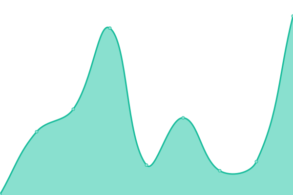 384ms
     
 | 

<a href="https://git.seeu.me/history/www-michelin-com-ar">100.00%</a>
    

|  [www.michelin.com.co](https://www.michelin.com.co) | 🟩 Up | [www-michelin-com-co.yml](https://github.com/cmadera/uptime/commits/HEAD/history/www-michelin-com-co.yml) | 

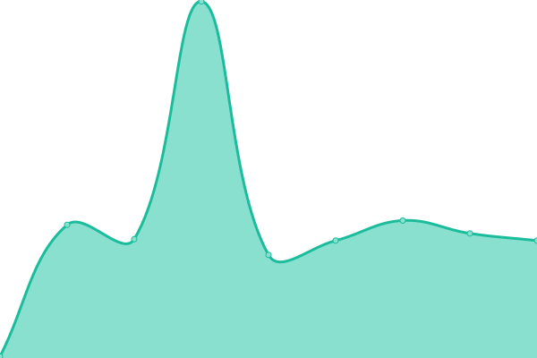 211ms
     
 | 

<a href="https://git.seeu.me/history/www-michelin-com-co">100.00%</a>
    

|  [www.bfgoodrich.cl](https://www.bfgoodrich.cl) | 🟩 Up | [www-bfgoodrich-cl.yml](https://github.com/cmadera/uptime/commits/HEAD/history/www-bfgoodrich-cl.yml) | 

 282ms
     
 | 

<a href="https://git.seeu.me/history/www-bfgoodrich-cl">100.00%</a>
    

|  [www.michelin.cl](https://www.michelin.cl) | 🟩 Up | [www-michelin-cl.yml](https://github.com/cmadera/uptime/commits/HEAD/history/www-michelin-cl.yml) | 

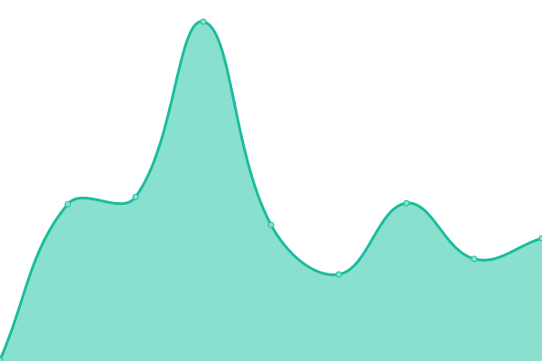 260ms
     
 | 

<a href="https://git.seeu.me/history/www-michelin-cl">100.00%</a>
    

|  [www.michelin.com.pe](https://www.michelin.com.pe) | 🟩 Up | [www-michelin-com-pe.yml](https://github.com/cmadera/uptime/commits/HEAD/history/www-michelin-com-pe.yml) | 

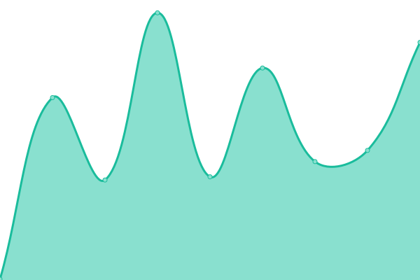 301ms
     
 | 

<a href="https://git.seeu.me/history/www-michelin-com-pe">100.00%</a>
    

|  [www.michelin.com.br](https://www.michelin.com.br) | 🟩 Up | [www-michelin-com-br.yml](https://github.com/cmadera/uptime/commits/HEAD/history/www-michelin-com-br.yml) | 

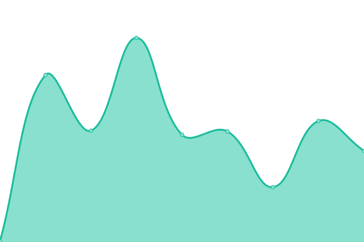 187ms
     
 | 

<a href="https://git.seeu.me/history/www-michelin-com-br">100.00%</a>
    

|  [www.pneusbfgoodrich.com.br](https://www.pneusbfgoodrich.com.br) | 🟩 Up | [www-pneusbfgoodrich-com-br.yml](https://github.com/cmadera/uptime/commits/HEAD/history/www-pneusbfgoodrich-com-br.yml) | 

 208ms
     
 | 

<a href="https://git.seeu.me/history/www-pneusbfgoodrich-com-br">100.00%</a>
    

|  [www.bfgoodrichargentina.com.ar](https://www.bfgoodrichargentina.com.ar) | 🟩 Up | [www-bfgoodrichargentina-com-ar.yml](https://github.com/cmadera/uptime/commits/HEAD/history/www-bfgoodrichargentina-com-ar.yml) | 

 285ms
     
 | 

<a href="https://git.seeu.me/history/www-bfgoodrichargentina-com-ar">100.00%</a>
    

|  [www.michelinamericalatina.com](https://www.michelinamericalatina.com) | 🟩 Up | [www-michelinamericalatina-com.yml](https://github.com/cmadera/uptime/commits/HEAD/history/www-michelinamericalatina-com.yml) | 

 810ms
     
 | 

<a href="https://git.seeu.me/history/www-michelinamericalatina-com">100.00%</a>
    

|  [www.pneustigar.com.br](https://www.pneustigar.com.br) | 🟩 Up | [www-pneustigar-com-br.yml](https://github.com/cmadera/uptime/commits/HEAD/history/www-pneustigar-com-br.yml) | 

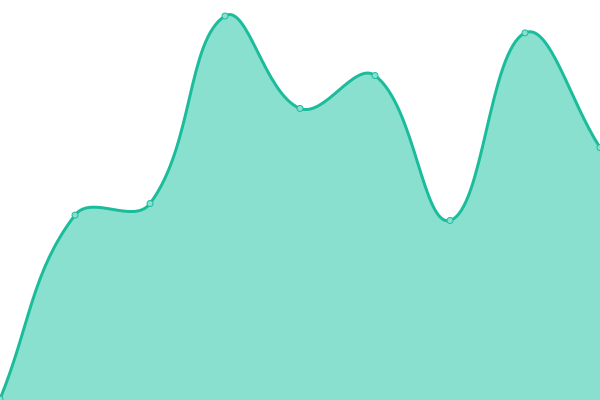 433ms
     
 | 

<a href="https://git.seeu.me/history/www-pneustigar-com-br">100.00%</a>
    

|  [www.levorin.com.br](https://www.levorin.com.br) | 🟩 Up | [www-levorin-com-br.yml](https://github.com/cmadera/uptime/commits/HEAD/history/www-levorin-com-br.yml) | 

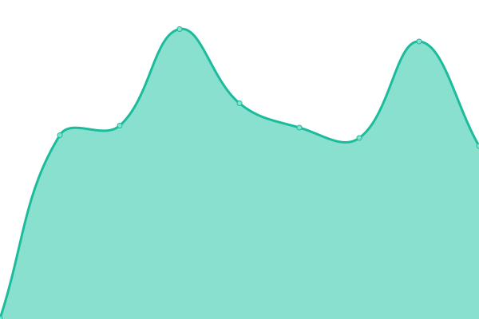 749ms
     
 | 

<a href="https://git.seeu.me/history/www-levorin-com-br">100.00%</a>
    

|  [www.llantastigar.com.co](https://www.llantastigar.com.co) | 🟩 Up | [www-llantastigar-com-co.yml](https://github.com/cmadera/uptime/commits/HEAD/history/www-llantastigar-com-co.yml) | 

 387ms
     
 | 

<a href="https://git.seeu.me/history/www-llantastigar-com-co">100.00%</a>
    

|  [www.llantastigar.com.ec](https://www.llantastigar.com.ec) | 🟩 Up | [www-llantastigar-com-ec.yml](https://github.com/cmadera/uptime/commits/HEAD/history/www-llantastigar-com-ec.yml) | 

 512ms
     
 | 

<a href="https://git.seeu.me/history/www-llantastigar-com-ec">100.00%</a>
    

|  [www.llantastigar.com.pe](https://www.llantastigar.com.pe) | 🟩 Up | [www-llantastigar-com-pe.yml](https://github.com/cmadera/uptime/commits/HEAD/history/www-llantastigar-com-pe.yml) | 

 435ms
     
 | 

<a href="https://git.seeu.me/history/www-llantastigar-com-pe">100.00%</a>
    

|  [www.neumaticostigar.com.ar](https://www.neumaticostigar.com.ar) | 🟩 Up | [www-neumaticostigar-com-ar.yml](https://github.com/cmadera/uptime/commits/HEAD/history/www-neumaticostigar-com-ar.yml) | 

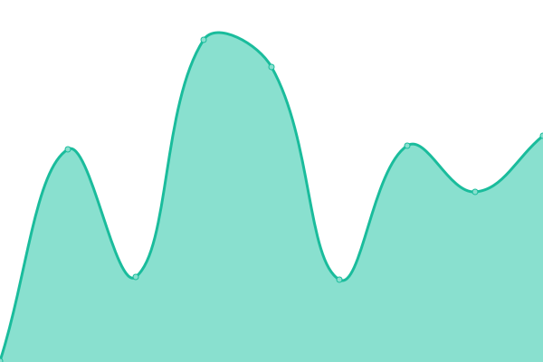 495ms
     
 | 

<a href="https://git.seeu.me/history/www-neumaticostigar-com-ar">100.00%</a>
    

|  [www.uniroyal.com.br](https://www.uniroyal.com.br) | 🟥 Down | [www-uniroyal-com-br.yml](https://github.com/cmadera/uptime/commits/HEAD/history/www-uniroyal-com-br.yml) | 

 0ms
     
 | 

<a href="https://git.seeu.me/history/www-uniroyal-com-br">100.00%</a>
    

|  [camiones-omnibus.michelin.com.ar](https://camiones-omnibus.michelin.com.ar) | 🟩 Up | [camiones-omnibus-michelin-com-ar.yml](https://github.com/cmadera/uptime/commits/HEAD/history/camiones-omnibus-michelin-com-ar.yml) | 

 633ms
     
 | 

<a href="https://git.seeu.me/history/camiones-omnibus-michelin-com-ar">100.00%</a>
    

|  [caminhoes-onibus.michelin.com.br](https://caminhoes-onibus.michelin.com.br) | 🟩 Up | [caminhoes-onibus-michelin-com-br.yml](https://github.com/cmadera/uptime/commits/HEAD/history/caminhoes-onibus-michelin-com-br.yml) | 

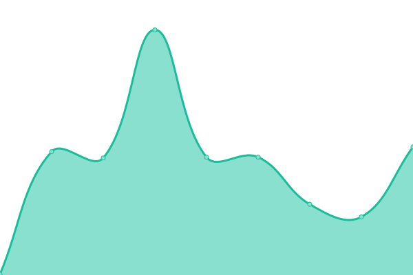 271ms
     
 | 

<a href="https://git.seeu.me/history/caminhoes-onibus-michelin-com-br">100.00%</a>
    

|  [camiones-omnibus.michelin.cl](https://camiones-omnibus.michelin.cl) | 🟩 Up | [camiones-omnibus-michelin-cl.yml](https://github.com/cmadera/uptime/commits/HEAD/history/camiones-omnibus-michelin-cl.yml) | 

 1359ms
     
 | 

<a href="https://git.seeu.me/history/camiones-omnibus-michelin-cl">100.00%</a>
    

|  [camiones-omnibus.michelin.com.ec](https://camiones-omnibus.michelin.com.ec) | 🟩 Up | [camiones-omnibus-michelin-com-ec.yml](https://github.com/cmadera/uptime/commits/HEAD/history/camiones-omnibus-michelin-com-ec.yml) | 

 840ms
     
 | 

<a href="https://git.seeu.me/history/camiones-omnibus-michelin-com-ec">100.00%</a>
    

|  [camiones-omnibus.michelin.com.pe](https://camiones-omnibus.michelin.com.pe) | 🟩 Up | [camiones-omnibus-michelin-com-pe.yml](https://github.com/cmadera/uptime/commits/HEAD/history/camiones-omnibus-michelin-com-pe.yml) | 

 742ms
     
 | 

<a href="https://git.seeu.me/history/camiones-omnibus-michelin-com-pe">100.00%</a>
    

|  [camiones-omnibus.michelin.com.co](https://camiones-omnibus.michelin.com.co) | 🟩 Up | [camiones-omnibus-michelin-com-co.yml](https://github.com/cmadera/uptime/commits/HEAD/history/camiones-omnibus-michelin-com-co.yml) | 

 790ms
     
 | 

<a href="https://git.seeu.me/history/camiones-omnibus-michelin-com-co">100.00%</a>
    

|  [camiones-omnibus.michelin.com.ve](https://camiones-omnibus.michelin.com.ve) | 🟩 Up | [camiones-omnibus-michelin-com-ve.yml](https://github.com/cmadera/uptime/commits/HEAD/history/camiones-omnibus-michelin-com-ve.yml) | 

 900ms
     
 | 

<a href="https://git.seeu.me/history/camiones-omnibus-michelin-com-ve">100.00%</a>
    

|  [red.michelin.com.ar](https://red.michelin.com.ar) | 🟩 Up | [red-michelin-com-ar.yml](https://github.com/cmadera/uptime/commits/HEAD/history/red-michelin-com-ar.yml) | 

 437ms
     
 | 

<a href="https://git.seeu.me/history/red-michelin-com-ar">100.00%</a>
    

|  [stage.ar.camso.co](https://stage.ar.camso.co) | 🟩 Up | [stage-ar-camso-co.yml](https://github.com/cmadera/uptime/commits/HEAD/history/stage-ar-camso-co.yml) | 

 919ms
     
 | 

<a href="https://git.seeu.me/history/stage-ar-camso-co">100.00%</a>
    

|  [stage.br.camso.co](https://stage.br.camso.co) | 🟩 Up | [stage-br-camso-co.yml](https://github.com/cmadera/uptime/commits/HEAD/history/stage-br-camso-co.yml) | 

 1088ms
     
 | 

<a href="https://git.seeu.me/history/stage-br-camso-co">100.00%</a>
    

|  [red.michelin.cl](https://red.michelin.cl) | 🟩 Up | [red-michelin-cl.yml](https://github.com/cmadera/uptime/commits/HEAD/history/red-michelin-cl.yml) | 

 515ms
     
 | 

<a href="https://git.seeu.me/history/red-michelin-cl">100.00%</a>
    

|  [redemichelinboapratica.net](https://redemichelinboapratica.net) | 🟩 Up | [redemichelinboapratica-net.yml](https://github.com/cmadera/uptime/commits/HEAD/history/redemichelinboapratica-net.yml) | 

 230ms
     
 | 

<a href="https://git.seeu.me/history/redemichelinboapratica-net">100.00%</a>
    

|  [www.michelin-ads.com](https://www.michelin-ads.com) | 🟩 Up | [www-michelin-ads-com.yml](https://github.com/cmadera/uptime/commits/HEAD/history/www-michelin-ads-com.yml) | 

 781ms
     
 | 

<a href="https://git.seeu.me/history/www-michelin-ads-com">100.00%</a>
    

|  [www.redmichelin.com](https://www.redmichelin.com) | 🟩 Up | [www-redmichelin-com.yml](https://github.com/cmadera/uptime/commits/HEAD/history/www-redmichelin-com.yml) | 

 879ms
     
 | 

<a href="https://git.seeu.me/history/www-redmichelin-com">100.00%</a>
    

|  [www.redemichelin.com.br](https://www.redemichelin.com.br) | 🟩 Up | [www-redemichelin-com-br.yml](https://github.com/cmadera/uptime/commits/HEAD/history/www-redemichelin-com-br.yml) | 

 897ms
     
 | 

<a href="https://git.seeu.me/history/www-redemichelin-com-br">100.00%</a>
    

|  [compras.michelin-ads.com](https://compras.michelin-ads.com) | 🟩 Up | [compras-michelin-ads-com.yml](https://github.com/cmadera/uptime/commits/HEAD/history/compras-michelin-ads-com.yml) | 

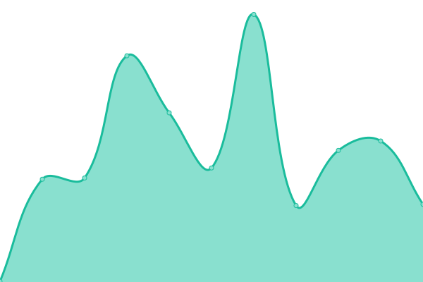 867ms
     
 | 

<a href="https://git.seeu.me/history/compras-michelin-ads-com">100.00%</a>
    

|  [bibnetads-qa.michelin.com/bibnetBR](https://bibnetads-qa.michelin.com/bibnetBR) | 🟩 Up | [bibnetads-qa-michelin-com-bibnet-br.yml](https://github.com/cmadera/uptime/commits/HEAD/history/bibnetads-qa-michelin-com-bibnet-br.yml) | 

 752ms
     
 | 

<a href="https://git.seeu.me/history/bibnetads-qa-michelin-com-bibnet-br">98.55%</a>
    

|  [cardealer.michelin.com.br](https://cardealer.michelin.com.br) | 🟩 Up | [cardealer-michelin-com-br.yml](https://github.com/cmadera/uptime/commits/HEAD/history/cardealer-michelin-com-br.yml) | 

 332ms
     
 | 

<a href="https://git.seeu.me/history/cardealer-michelin-com-br">100.00%</a>
    

|  [fleetmanager.michelin.com.br](https://fleetmanager.michelin.com.br) | 🟩 Up | [fleetmanager-michelin-com-br.yml](https://github.com/cmadera/uptime/commits/HEAD/history/fleetmanager-michelin-com-br.yml) | 

 352ms
     
 | 

<a href="https://git.seeu.me/history/fleetmanager-michelin-com-br">100.00%</a>
    

|  [api.fleetmanager.michelin.com.br](https://api.fleetmanager.michelin.com.br) | 🟩 Up | [api-fleetmanager-michelin-com-br.yml](https://github.com/cmadera/uptime/commits/HEAD/history/api-fleetmanager-michelin-com-br.yml) | 

 297ms
     
 | 

<a href="https://git.seeu.me/history/api-fleetmanager-michelin-com-br">100.00%</a>
    

|  [dmichelin.brprop.com.br](https://dmichelin.brprop.com.br) | 🟥 Down | [dmichelin-brprop-com-br.yml](https://github.com/cmadera/uptime/commits/HEAD/history/dmichelin-brprop-com-br.yml) | 

 3135ms
     
 | 

<a href="https://git.seeu.me/history/dmichelin-brprop-com-br">100.00%</a>
    

|  [www.guiadopneu.com.br](https://www.guiadopneu.com.br) | 🟩 Up | [www-guiadopneu-com-br.yml](https://github.com/cmadera/uptime/commits/HEAD/history/www-guiadopneu-com-br.yml) | 

 274ms
     
 | 

<a href="https://git.seeu.me/history/www-guiadopneu-com-br">100.00%</a>
    

|  [ofertasmichelin.com.br](https://ofertasmichelin.com.br) | 🟩 Up | [ofertasmichelin-com-br.yml](https://github.com/cmadera/uptime/commits/HEAD/history/ofertasmichelin-com-br.yml) | 

 856ms
     
 | 

<a href="https://git.seeu.me/history/ofertasmichelin-com-br">100.00%</a>
    

|  [vagas.michelin.com.br](https://vagas.michelin.com.br) | 🟩 Up | [vagas-michelin-com-br.yml](https://github.com/cmadera/uptime/commits/HEAD/history/vagas-michelin-com-br.yml) | 

 2045ms
     
 | 

<a href="https://git.seeu.me/history/vagas-michelin-com-br">100.00%</a>
    

|  [bibnetads.michelin.com](https://bibnetads.michelin.com) | 🟩 Up | [bibnetads-michelin-com.yml](https://github.com/cmadera/uptime/commits/HEAD/history/bibnetads-michelin-com.yml) | 

 889ms
     
 | 

<a href="https://git.seeu.me/history/bibnetads-michelin-com">100.00%</a>
    

|  [webads.michelin.com](https://webads.michelin.com) | 🟩 Up | [webads-michelin-com.yml](https://github.com/cmadera/uptime/commits/HEAD/history/webads-michelin-com.yml) | 

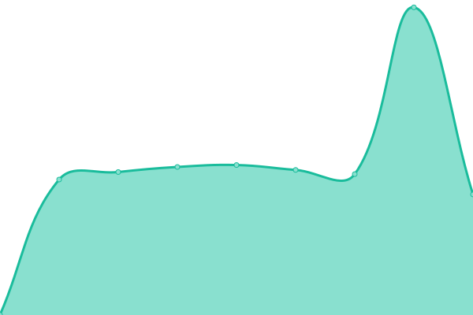 1001ms
     
 | 

<a href="https://git.seeu.me/history/webads-michelin-com">100.00%</a>
    

|  [rutasegura.michelin.com.co](https://rutasegura.michelin.com.co) | 🟩 Up | [rutasegura-michelin-com-co.yml](https://github.com/cmadera/uptime/commits/HEAD/history/rutasegura-michelin-com-co.yml) | 

 1802ms
     
 | 

<a href="https://git.seeu.me/history/rutasegura-michelin-com-co">100.00%</a>
    

|  [extranetlevorin.com](https://extranetlevorin.com) | 🟩 Up | [extranetlevorin-com.yml](https://github.com/cmadera/uptime/commits/HEAD/history/extranetlevorin-com.yml) | 

 344ms
     
 | 

<a href="https://git.seeu.me/history/extranetlevorin-com">100.00%</a>
    

|  [www.ofertasmichelin.com.br](https://www.ofertasmichelin.com.br) | 🟩 Up | [www-ofertasmichelin-com-br.yml](https://github.com/cmadera/uptime/commits/HEAD/history/www-ofertasmichelin-com-br.yml) | 

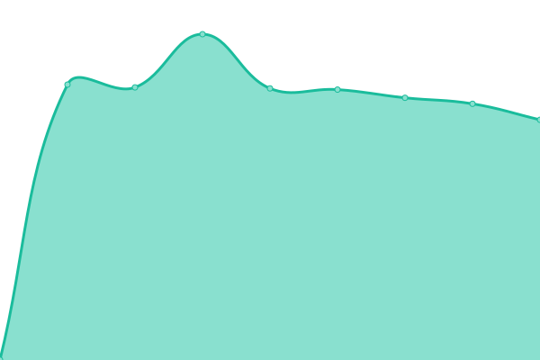 1648ms
     
 | 

<a href="https://git.seeu.me/history/www-ofertasmichelin-com-br">100.00%</a>
    

|  [www.redemichelinboapratica.net](https://www.redemichelinboapratica.net) | 🟩 Up | [www-redemichelinboapratica-net.yml](https://github.com/cmadera/uptime/commits/HEAD/history/www-redemichelinboapratica-net.yml) | 

 334ms
     
 | 

<a href="https://git.seeu.me/history/www-redemichelinboapratica-net">100.00%</a>
    

|  [tbsgc.michelin-ads.com](https://tbsgc.michelin-ads.com) | 🟩 Up | [tbsgc-michelin-ads-com.yml](https://github.com/cmadera/uptime/commits/HEAD/history/tbsgc-michelin-ads-com.yml) | 

 220ms
     
 | 

<a href="https://git.seeu.me/history/tbsgc-michelin-ads-com">100.00%</a>
    

<!--end: status pages-->

[**Visit our status website →**](https://upptime.github.io/upptime)

## 📄 License

- Powered by: [Upptime](https://github.com/upptime/upptime)
- Code: [MIT](./LICENSE) © [Upptime](https://upptime.js.org)
- Data in the `./history` directory: [Open Database License](https://opendatacommons.org/licenses/odbl/1-0/)
